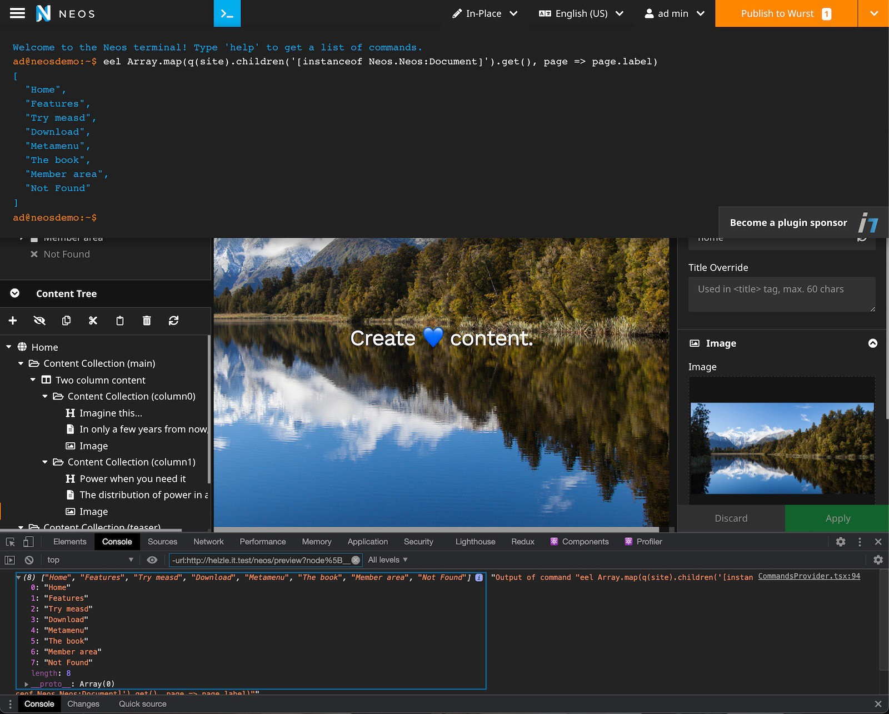

# Neos CMS terminal for running Eel expressions and other commands in the UI

This package provides a Terminal emulator plugin for the [Neos CMS](https://www.neos.io) UI.
Several commands are provided to save time during development & debugging of Neos CMS projects.

All commands and their output are also automatically available in the browser dev console
as `NeosTerminal` - for easier handling of JSON results and persistent history. 

It uses the great [terminal component](https://github.com/linuswillner/react-console-emulator) by [Linus Willner](https://github.com/linuswillner).

## Example



## Installation

Run the following command in your Neos project:

```shell
composer require shel/neos-terminal
```

### Supported Neos versions

Due to required React features, the Terminal UI integration is only available 
for more recent Neos versions which provide React >= 16.8.
But the commands are still registered and available via the `NeosTerminal` global 
window object even when the React version is too old.

| Neos version  | Terminal         |
| ------------- | ---------------- |
| 4.3           | Commands are only available via the browser console |
| 5.2 - 5.3     | Full support     |
| 7.0+          | Full support     |

## Usage

There are three ways to access the terminal functionality:

1. Open the terminal by clicking on the terminal icon in the top menu bar in the Neos backend.
2. Open the terminal with the `t t` hotkey (configured via the Neos hotkey API in the `Settings.yaml`).
3. Access the terminal commands from the browser dev console via the global `NeosTerminal` object.

Now you can run any of the provided commands, or your own.

## Included commands

Available default commands:

* `eel` - Eel expression parser
* `flushCache` - Flush one or all Neos/Flow caches
* `help` - Show command list
* `clear` - Clear terminal

You can add [custom commands](#adding-your-own-commands). 

### Eel evaluator

The `eel` command allows you to run any Eel expression.

You can run simple expressions:

```
eel 5+2
```                                  

Read a specific setting:

```
eel Configuration.setting('Neos.Flow.core.context')
```                               

Get a list of all Eel helpers:

```
eel Configuration.setting('Neos.Fusion.defaultContext')
```

Or more complex ones. The following call will return the labels of all subpages of your homepage: 

```
eel Array.map(q(site).children().get(), page => page.label)
```

By default, the current `siteNode`, `documentNode` and the currently selected `node` are
available in your expression context.

*Note:* The command will run some conversions on the result:

* If the result is a node or a list of nodes, each node will be replaced
with a list of their `properties`.
* Properties that are objects are replaced with their classname.

This will be optimised in future releases and should improve the readability of the output.

### Flush caches

The `flushCache` command allows you to flush all caches or a single cache.

E.g. the following call will flush the Fusion rendering cache:

```
flushCache Neos_Fusion_Content
```

If the cache identifier is omitted, all caches are flushed.

Please use this command only when absolutely necessary.
Caching issues can be fixed in the implementation.

## Configuration

### Enabling the plugin in Production context 

By default, the plugin is only loaded in *Development* context.
If you want to have it active in *Production*, you have to override the setting in your `Settings.yaml`:

```yaml
Neos:
  Neos:
    Ui:
      frontendConfiguration:
        'Shel.Neos.Terminal:Terminal':
          enabled: true
```

### Security

Executing commands in the Neos backend opens up a possible security risk.

Therefore, if you use this plugin in production, make sure only a limited
number of users have access to it.

When creating your own commands, keep in mind to make sure nothing bad can happen to your
database or other systems.

Example: If you have your own Eel helper that can send API requests to another system 
with full write access, this could be abused by someone if a backend user with
enough privileges is hacked.

### Theming

Have a look at the [Settings.yaml](Configuration/Settings.yaml) in this package and its `frontendConfiguration`.
It allows you to override the theme with your own.

### Command policies

By default, any *Administrator* has full access to all existing and added commands.

Additionally, the role `Shel.Neos.Terminal:TerminalUser` exists which by default can only run the `eel` command.
You can add more privileges to this role to allow more commands and assign it to users or as a `parentRole` for other roles.
See [Policy.yaml](Configuration/Policy.yaml) in this package for examples.

## Adding your own commands

Adding your commands is quite easy (depending on what you plan to do).

Create a new class named `MyCommand` and implement the `TerminalCommandControllerPluginInterface` from 
this package or inherit from `AbstractTerminalCommand`. 
As soon as you implemented all required methods, you are good to go!

As an example, you can create a command to show the joke of the day with the following class.
Just adapt the namespace depending on your own package key.

```php
<?php
declare(strict_types=1);

namespace Vendor\Package\Command;

use Neos\Flow\Http\Client\Browser;
use Neos\Flow\Http\Client\CurlEngine;
use Shel\Neos\Terminal\Command\CommandContext;
use Shel\Neos\Terminal\Command\CommandInvocationResult;
use Shel\Neos\Terminal\Command\TerminalCommandInterface;

class JokeCommand implements TerminalCommandInterface
{           

    public static function getCommandName(): string
    {
        return 'jod';
    }

    public static function getCommandDescription(): string
    {
        return 'Joke of the day';
    }

    public static function getCommandUsage(): string
    {
        return 'jod [<string>]';
    }

    public function invokeCommand(string $argument, CommandContext $commandContext): CommandInvocationResult
    {
        $browser = new Browser();
        $browser->setRequestEngine(new CurlEngine());
        $jokeResponse = json_decode($browser->request('https://api.jokes.one/jod')->getBody()->getContents());
        $joke = $jokeResponse->contents->jokes[0]->joke;

        $result = $joke->title . ': ' . $joke->text;

        return new CommandInvocationResult(true, $result);
    }
}
```

Did you create awesome commands that could be helpful to others?
Send a link to a [gist](https://gist.github.com) containing the PHP 
class or a link to your repo, and we can add it to the docs.

### Providing commands in other packages

If you have a package that provides a command, you should check whether the
Terminal is installed in your code when defining the command.

In order to achieve that, you have to wrap the command class in a condition
and use the fully qualified name to reference classes and interfaces from the 
Terminal package:

```php
if (interface_exists('Shel\Neos\Terminal\Command\TerminalCommandInterface', false)) {
    class JokeCommand implements \Shel\Neos\Terminal\Command\TerminalCommandInterface
    {
        public static function getCommandName(): string { ... }
        public static function getCommandDescription(): string { ... }
        public static function getCommandUsage(): string { ... }

        public function invokeCommand(string $argument, \Shel\Neos\Terminal\Command\CommandContext $commandContext): \Shel\Neos\Terminal\Command\CommandInvocationResult {
            ...

            return new \Shel\Neos\Terminal\Command\CommandInvocationResult(true, $result);
        }
    }
} else {
    class JodCommand {}
}
```

## Supporting this plugin / how to get rid of the sponsorship badge

Creating and maintaining a plugin like this takes a lot of time.
Therefore, I decided to add a small nagging badge to promote financial support for my work.

There are several ways to get rid of the little sponsoring badge in the terminal:

1. Get in touch with [me](sponsor@helzle.it) for a direct sponsoring of 100€ (excl. VAT) / registration key
2. Become a sponsor via [Github](https://github.com/sebobo) 20$+/month level
3. Become a [patreon](https://www.patreon.com/shelzle) 20$+/month level

In return, you will feel much better, and you get a registration key you can put
into your settings which will disable the mentioned badge.

This will help me to further develop this and other plugins.
Of course, I'll also do my best to react quickly to issues & questions.

There is a 4th way: Fork this repo and patch the verification check (or whatever other way you might find).
Sure you can do that. But you will receive bad karma, and you won't be helping the future of this plugin.

If the badge doesn't bother you, that's fine too. Keep it and enjoy the plugin :).

## Contribute

Contributions are very welcome.

For code contributions, please create a fork and create a PR against the lowest maintained
branch of this repository (currently master).

* Don't include any generated file in `/Resources/Public/` in your change.
* Please provide a thorough explanation of your change and well-formed commit messages in your commits.

## License

See [License](LICENSE.txt)
